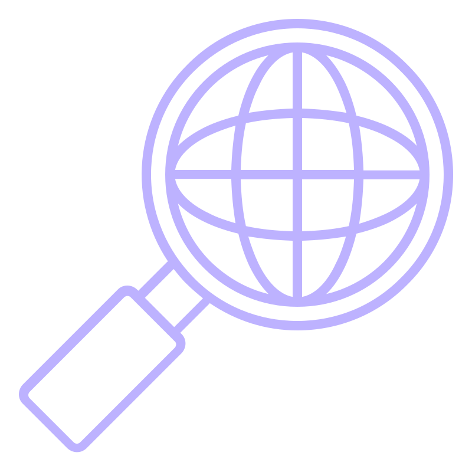
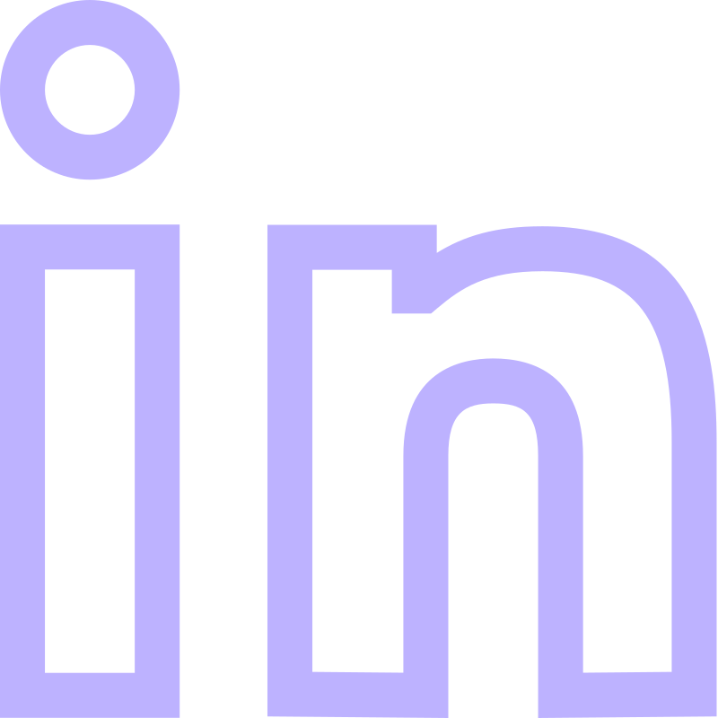
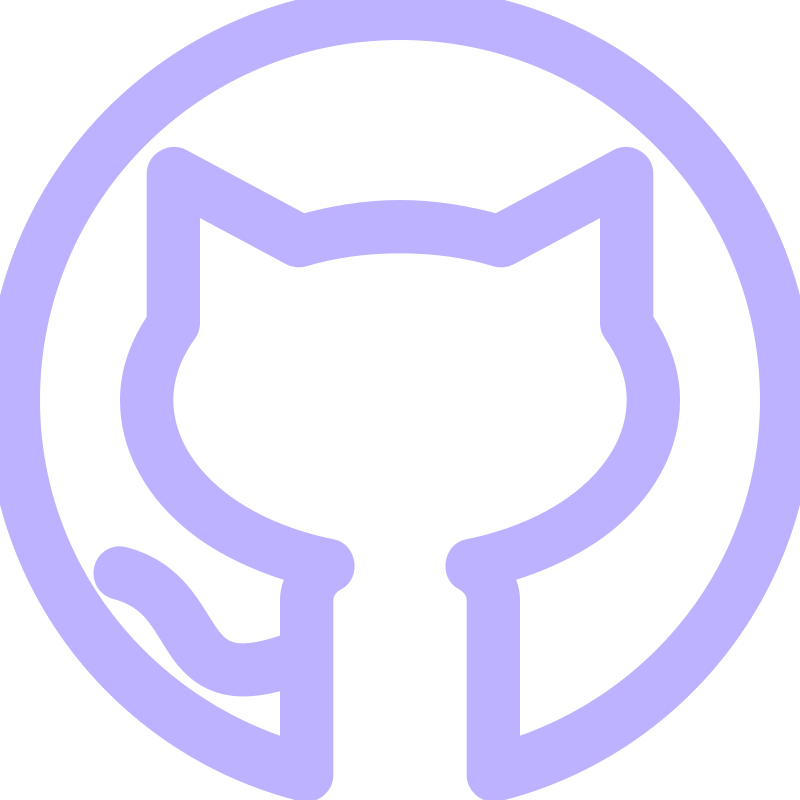
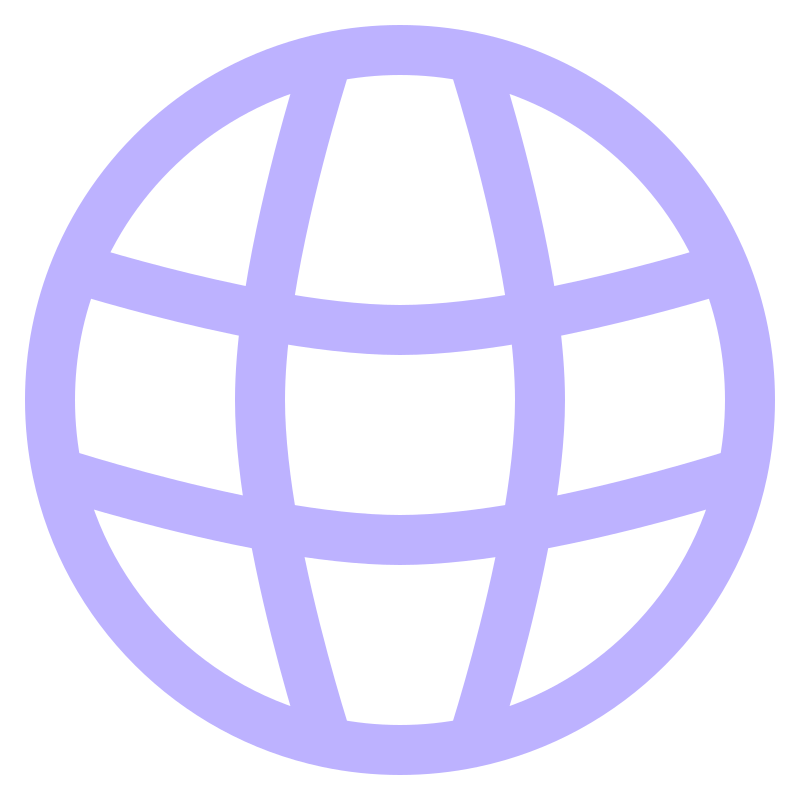

<h2 align="center">Ahoj / Hello / Hallo / Hola 👋</h2>

<h4 align="center">Once a wet lab biologist, now busy with data analysis, reporting, testing and co-development of internal tools at Resolve Biosciences</h4>
 

### Skills
- proficient in , which I love to combine with  and 
-  and  for data visualization
- confident with 
- experience with , , and 

### Some facts
- 🧬 Degrees in Molecular and Cell Biology, and Biology
- 🌱 Once researching Crassulacean Acid Metabolism (CAM) photosynthesis
- 🎯 Goals: improve my DataViz skills, learn  and 
- 👟 Passionate runner
- 🥖 And sourdough bread baker

### Where to find me  
  
  
  
### Selected projects

|  Repo | Decription | Links | Tools |
|  --- | --- | --- | --- |
| **#30DayChartChallenge** | A collection of my contributions for the annual #30DayChartChallenge | |   |
| **Baron Trenck's Unraveled Secrets** | My contribution for the Posit's Closeread Prize (Scrollytelling with Quarto) |   |   |
| **Paris 2024 Olympics dashboard** | A fun project about the Games to practice dashboarding |   |    |
| **TidyTuesday** | A collection of my contributions for the TidyTuesday initiative |  |   |

----------------------------------------------------------------------------------

Created with [img.shields.io](https://img.shields.io/), emojis from [https://emojipedia.org](https://emojipedia.org), and customizable CVG icons from [https://www.svgrepo.com](https://www.svgrepo.com)

<!--
(GitHub: https://github.com/emaleckova/trenck-closeread) 
 (GitHub: https://github.com/emaleckova/paris-2024-medals)  
-->

<!--
**emaleckova/emaleckova** is a ✨ _special_ ✨ repository because its `README.md` (this file) appears on your GitHub profile.

Here are some ideas to get you started:

- 🔭 I’m currently working on ...
- 🌱 I’m currently learning ...
- 👯 I’m looking to collaborate on ...
- 🤔 I’m looking for help with ...
- 💬 Ask me about ...
- 📫 How to reach me: ...
- 😄 Pronouns: ...
- ⚡ Fun fact: ...
-->
